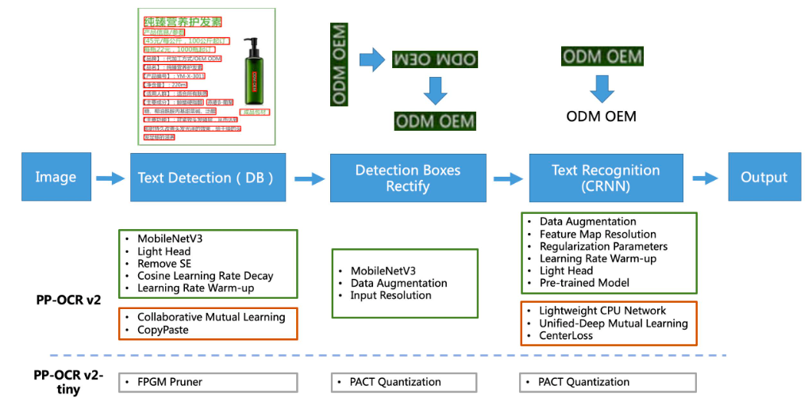

# SSME MP 基于计算机视觉的病床测距工具
  
这是一个基于MMLab下的MMdetection和MMPose的CV测距工具项目  
项目包含比较完整的训练流程封装，方便后续开发者重新构建基于MMLab新项目。
效果图如下所示：
> **注意：** 训练数据集未在仓库里。


## 项目需求
项目希望能在病床耐久测试中，使用计算机分析病床实际移动与测试移动距离差值的误差是否满足预期，实现降低cost的目的。  
> 具体要求如下：
> - 自动化：程序自动化包括降低：摄像头旋转角、刻度尺与病床夹角和钢尺刻度反光等干扰的影响，降低工作流中人工参与的步骤占比。
> - 准确度：期望模型【刻度读数】与真实值误差不大于0.1mm，【距离读数】误差不大于0.5mm
> - 封装性：模型训练步骤应尽量简单，方便后面数据集更换或模型迁移。
 

## 项目实现逻辑
### 1. 模型搭建

1. 摄像头部署：摄像头采用海康MV系列相机，16MM定焦镜头、摄像头通过可调节支架悬挂于病床之上，俯视病床拍照。
2. 钢尺部署：将量程为2m，精度为1mm的钢尺放置于病床侧板，用热熔胶固定位置，尺子方向与病床移动方向平行。
3. 连接：摄像头通过以太网口链接交换机经行远程控制或者直接链接电脑，使用相机的SDK自动抓取图片结果，并存储到缓存区或本地。
4. 本地视频流处理：开启视频流读取线程，按照指定时隙抓取关键帧，并传入模型网络经行分析。
5. 显示输出：模型将读数与误差绘制在输出图像上，并将读数结果以CSV数据集格式保存在本地。

### 2. 模型读数逻辑

1. 数字目标识别：模型基于MMDetection实现钢尺数字位置定位，返回数字Anchor坐标 [(x1, y1),(x2, y2)]、对应的label和IOU交并比。
2. keypoints定位：模型基于MMPose实现自顶向下的Heatmap关键点定位，定位范围为步骤1返回Anchor区域内，返回刻度值关键点坐标 (x, y) 。
3. 读数指针pin定位：pin针取图像中位线，中位线与钢尺刻度线段的交点，为该图像的读数关键点。
4. OCR读取刻度数字：利用CV将步骤1识别的数字传入OCR网路经行识别，将输出结果经行过滤，只保留连续数字部分，将结果作为cm级读数。
5. 模型读数：如下图所示，在图片中按照刻数字划分刻度区间，通过计算pin针与所在所在刻度区间的交点，与整段1cm像素距离的比例，得出mm级读数。
6. OpenCV读数：使用基于CV2的图像连通域分割技术，对数字区域做降噪和二值化处理，降低光照因素干扰，得到基于CV2的读数。
7. 模型误差：将步骤【4、5】的模型读数和步骤【6】模型读数做差值，得出误差error。并将结果使用角度误差θ校对，得到最终输出结果Num_value.
8. 结果显示与保存：将num_value和error绘制在原图上，如果为视频流识别，将每次识别结果保存在本地CSV中。

### 3. 角度误差θ校对
1. 误差产生原因：模型搭建时摄像头存在旋转角误差，因此照片中刻度尺与水平存在倾角θ1。此外，钢尺和病床水平也存在倾角θ2，两者皆会影响读数结果。
2. 消除角度误差：误差主要来源于θ2，通过简单三角形边角关系可以通过θ1计算出θ2，从而对模型输出结果经行调整。


### 4. 项目Pipeline
（待作图）


## 主要技术原理以及框架
程序主要使用了基于OpenMMLab工具下的MMDetection和MMpose技术，以实现对钢尺刻度以及刻度值的识别预测。  
通过对相机收集的钢尺数据集进行标注，制作成COCO数据集，输入网络进行训练。保存训练模型后，使用训练好的模型进行推理预测，对预测结果进行OCR和集合分析，从而得出实际的读数结果。

### 1. PaddleOCR模型 [链接：PP飞浆PaddleOCR](https://github.com/PaddlePaddle/PaddleOCR/blob/release/2.3/README_ch.md#%E6%96%87%E6%A1%A3%E6%95%99%E7%A8%8B)
PaddleOCR旨在打造一套丰富、领先、且实用的OCR工具库，助力使用者训练出更好的模型，并应用落地。



1. 使用理由：PPOCR为华中科技大学与百度公司联合开发的超轻量OCR系统，主要由DB文本检测、检测框矫正和CRNN文本识别三部分组成。该系统从骨干网络选择和调整、预测头部的设计、数据增强、学习率变换策略、
正则化参数选择，模型pipeline透明易调整，且模型仍在更新和维护。
2. 模型权重：使用模型最新的权重包，通过安装whl下载最新的模型骨架，或者可将骨架保存在本地，本地的骨架路径为（**paddleocr/model**）
3. 模型推理：安装wheel后可以简单调用方法实现对刻度数字的推理，简便快捷。

  

### 2. MMDetection模型 [链接：MMDetection](https://github.com/open-mmlab/mmdetection/blob/main/README_zh-CN.md)
MMDetection 是一个基于pytorch的目标检测开源工具箱。MMDetection具有较好的模块化设计，将检测框架解耦成不同的模块组件，通过组合不同的模块组件，用户可以自定义地检测模型。  
便且，MMdetection工具箱还支持了各种不同的检测任务，包括目标检测，实例分割，全景分割，以及半监督目标检测。


1. 使用理由：MMDetction集合了多种计算机视觉领域的方法，且支持较丰富的算法架构和最新的模块组件，可以满足各种基于CV的项目需求。此外，该工具在功能完善的同时
提供了较为自由的自定义功能，使得初学者更容易理解和上手。
2. Detection model: RTMdet_tiny， 从原仓库下载的HRNet的checkpoint
3. Backbone：HRNet
4. 使用训练好的模型代码：
> device = torch.device('cuda:0' if torch.cuda.is_available() else 'cpu')  
 
>    detector = init_detector(
        'data/rtmdet_tiny_triangle.py',
        'checkpoint/rtmdet_tiny_measurement_epoch_191_resize.pth',
        device=device
    )  
  
5. 模型推理：模型的推理结果为一串字典型数据，其中可通过标签labels和置信度对BBox框进行筛选，从而得到需要的结果。
6. 模型再训练：模型重训练需要更改一下部分：
>  1. 环境按照：安装相对应的CUDA和MMCV，否则无法调用CUDA算子对训练进行加速。
>  2. Labelme数据集构建：包括重新划分目标和关键点。
>  3. Labelme2COCO配置：根据需求更改coco格式的阻焊换脚本，可视化coco数据集。并从pycocotools和脚本中确认转换数据是否正确。
> 4. 分割数据集：对数据集经行划分。
> 5. 配置训练的config：根据任务需求配置config，mmpose和mmdet的config文件配置不同。
> 6. 模型评估：再config中设置模型的超参数，保存训练日志并压缩checkpoint。
> 7. 结果评估：使用训练好的模型进行推理，测试推理结果。
 
### 3. MMPose模型 [链接：MMPose](https://github.com/open-mmlab/mmpose/blob/main/README_CN.md)
MMPose 是一款基于Pytorch的姿态分析开源工具箱，支持当前学界广泛关注的主流姿态分析任务：主要包括2D多人姿态估计、2D手部姿态估计、2D人脸关键点检测、133
关键点全身人体姿态估计、3D人体形状恢复、服饰关键点检测、动物关键点检测等。MMpose复现了多种学界最先进的人体姿态分析模型，包括“自顶向下”和“自顶向上”两大类
算法。MMPose相比于其它主流的代码库，具有更高的模型进度和训练速度，并支持多样的数据集。


1. 使用理由：MMPose与MMdetection一样，均是比较成熟的计算机视觉开发工具，且与MMDetection可共用一份COCO数据集，在模型精度和部署运用上较于其它工具库有上手容易
、配置清晰明了等特点。
2. Detection model: RTMpose_Middle， 从原仓库下载的HRNet的checkpoint, 是一种“自顶向下”无下采样的算法。
3. Backbone：HRNet
4. 使用训练好的模型代码：
> device = torch.device('cuda:0' if torch.cuda.is_available() else 'cpu')  
 
> pose_estimator = init_pose_estimator(
        'data/rtmpose-s-triangle.py',
        'checkpoint/rtmpose_m_measurement_epoch_50_resize.pth',
        device=device,
        cfg_options={'model': {'test_cfg': {'output_heatmaps': True}}}
    )  
  
5. 模型推理：模型的推理结果为一串字典型数据，其中需要MMdetection提供的目标BBox，在该BBox中“自顶向下”构建Heatmap，并得出最可能出现的keypoint。
6. 模型再训练：模型重训练需要更改一下部分【与MMDetection一致】：
>  1. 环境按照：安装相对应的CUDA和MMCV，否则无法调用CUDA算子对训练进行加速。
>  2. Labelme数据集构建：包括重新划分目标和关键点。
>  3. Labelme2COCO配置：根据需求更改coco格式的阻焊换脚本，可视化coco数据集。并从pycocotools和脚本中确认转换数据是否正确。
> 4. 分割数据集：对数据集经行划分。
> 5. 配置训练的config：根据任务需求配置config，mmpose和mmdet的config文件配置不同。
> 6. 模型评估：再config中设置模型的超参数，保存训练日志并压缩checkpoint。
> 7. 结果评估：使用训练好的模型进行推理，测试推理结果。


### 4. 计算与读数
该模块主要功能是对模型计算的结果经行分析与计算，并基于图像像素处理，计算出钢尺的具体读数，数据处理pipeline如下图所示：  


对每个模块进行分析：

> 子模块逻辑说明：
> 1. 查看模型结果：整理模型运行结果并绘制在原图上：
> 2. 位置确认：判断中心pin针落入的刻度区间，确定十位数刻度位置，并分析左刻度是否为个位数刻度。
> 4. OCR矫正：对左刻度图片进行反光矫正后，使用OCR识别对应的刻度值，用于数值对比。
> 5. 几何关系：利用pin的两关键点和区间左右坐标的关键点分辨构建两条直线，通过计算两直线的交点所占像素比例，得出图片读数。
> 6. 模型误差：通过基于CV2连通区域分割技术，得到真实值读数，从而计算出模型误差，并将读数结果和误差绘制在图片上。
> 7. 测量误差：通过几何计算，降低倾角误差在距离读数中的影响。
>
### 5. 试验记录 
具体在MR 04病床上进行的实验，目的是测试模型在【读数误差】【测距误差】上的表现，其中读数误差因不大于0.1mm，测距误差不大于0.5mm，
原型机部分结果如下实验一、实验二所示：  


## 开发者内容
### 1. 安装
1. 开发者直接git本工程，安装requirement里要求的依赖包。    
2. 注意pytorch、MMCV以及MMEngine的版本需要与本地CUDA版本一致，否则会导致依赖无法正常运行。
3. 初次运行项目时，OCR会使用模型库最新的预测模型，若终端无法链接外网，则可将checkpoint单独下载后使用。  


```diff
尽量维持原先目录结构，运行的目录环境为../mmpose
```  

### 2. 更新
【2024.09.23】版本更新。使用新采集的数据集进行重新训练。


### 3. 使用方法
1.功能集成在main_ver2.0.py文件内，直接更改推理图片路径即可。
   
  
### 4. 报错处理:  
可能出现依赖库不一致报错，注意检查依赖文件。


### 4. 后续更新


